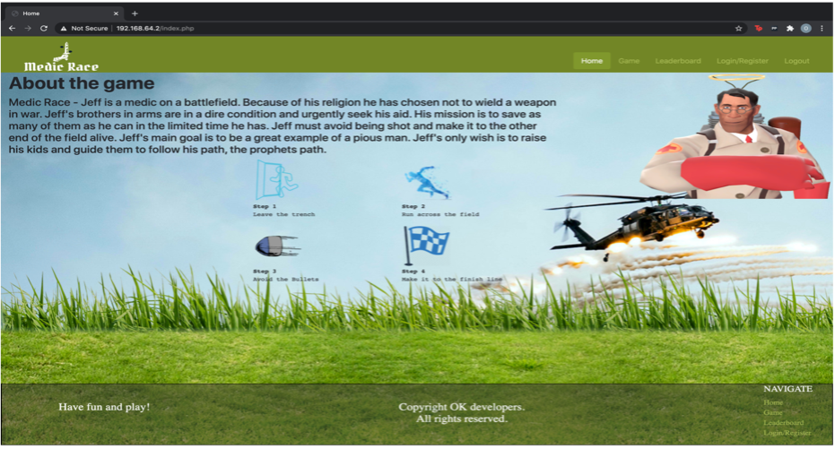
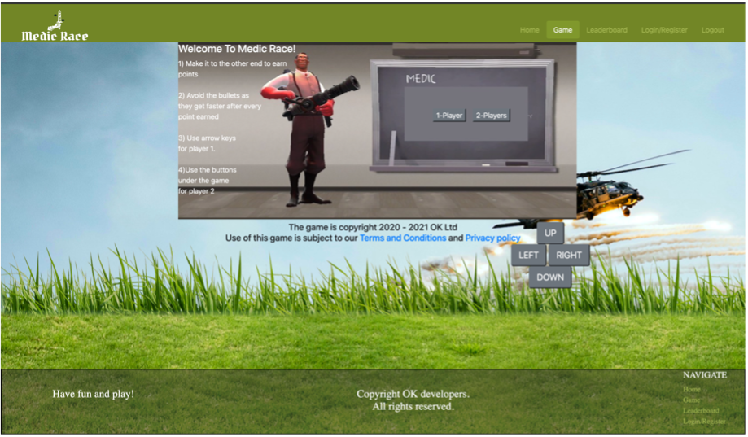
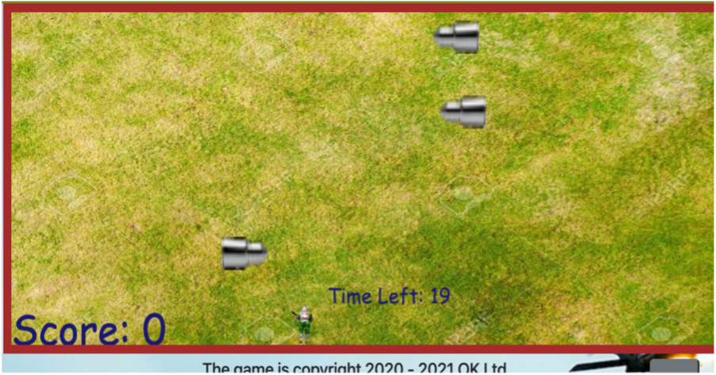
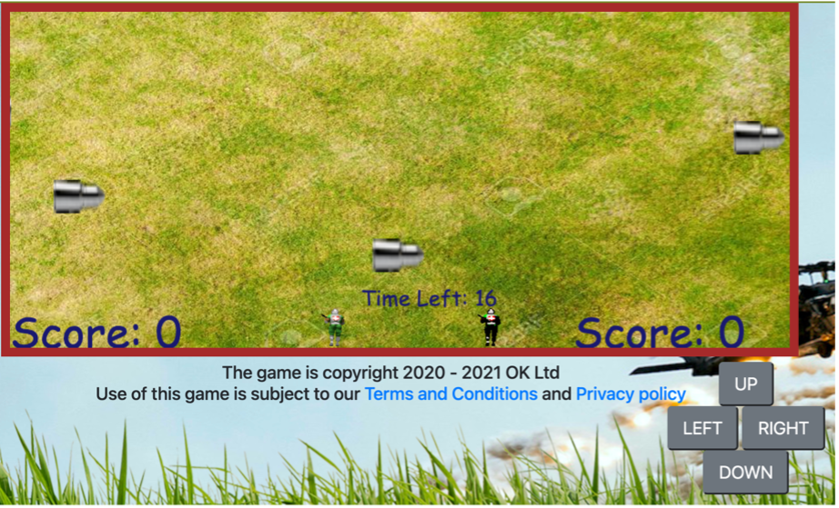
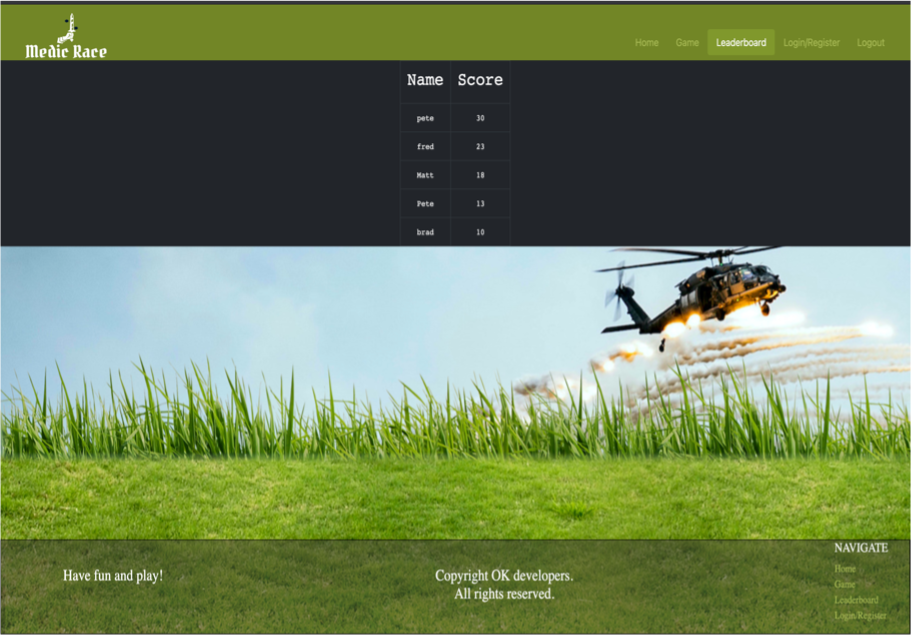
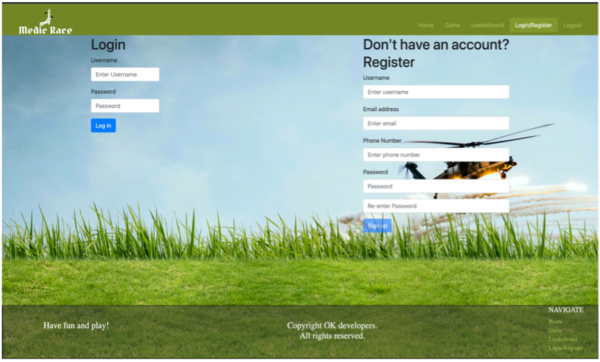

# Medic-Run-Game-Website
**Web Applications and Databases Coursework, Second Year of Computer Science**

  ## Scenario
- Website that enables the user to play a game.
- The user plays the game alone or against a second player
- The website is implemented in HTML, CSS, JavaScript and PHP.
- Users can register with the website and login.
- The website has a page that displays the top scores of all registered users.
- User data and scores are stored in JSON format using HTML local storage.
- PHP functions are used to output navigation menus, footers, etc.
- You are welcome to use third party libraries, such as jQuery, Bootstrap or a JavaScript game engine. You
should check with the module leader if a third party library is used for a substantial amount of the
functionality of your website.

In a nutshell, the aim of the game is to get across to the other side of the field without getting hit by the moving bullets (speed of the bullets is proportional to the player's points). Collision detection, controls and other functions used.

  Below are images of the pages of the website:
  
- &emsp; Home page
  
  &emsp;&emsp; 

- &emsp; Game page

  Prompt
  
  &emsp;&emsp; 

  1-Player
  
  &emsp;&emsp; 
  
  2-Players
  
  &emsp;&emsp; 
  
- &emsp; Leaderboard page. Every time the player finishes the game, the HTML local storage is updated and the leaderboard will display the logged in user's score and compare it with other registered users.
  
  &emsp;&emsp; 
  
- &emsp; Login/Register page. Includes many error-handling methods such as regex for registration, checking whether user is already logged in, and if correct information is entered when a login is attempted. 
  
  &emsp;&emsp; 
  
- &emsp; Logout page. Ensures active session is cleared and user is logged out.
  
  &emsp;&emsp; 
